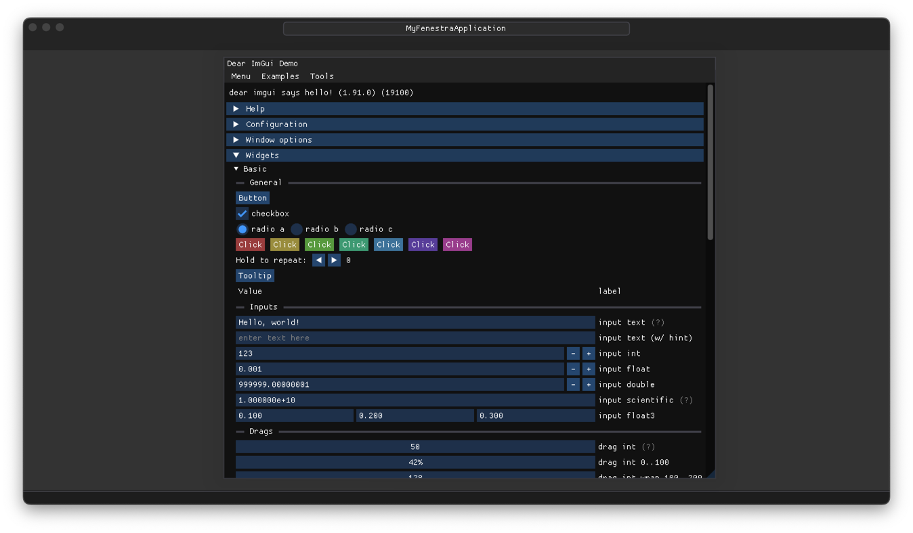

# Fenestra

Fenestra is an effort to create a cross-platform, free and open source Windowing and UI system based on SDL and ImGui.

Big parts of the repository are based on code originally written for [ImHex](https://github.com/WerWolv/ImHex).



## Sponsoring

If you use this project in a commercial project, please consider sponsoring me on [GitHub](https://github.com/sponsors/WerWolv) and get in contact!


## Getting Started

The easiest way to get started is by using the [Fenestra Template](https://github.com/WerWolv/Fenestra-Template). 
Create a new project using the template and you're good to go.
Windows, macOS and Linux are supported through cmake.

```bash
git clone https://github.com/YourName/YourFenestraProject.git
cd YourFenestraProject
mkdir build
cd build
cmake ..
cmake --build . --target fenestra_all
```

To launch the application, run the executable with the same name as your project in the build directory.